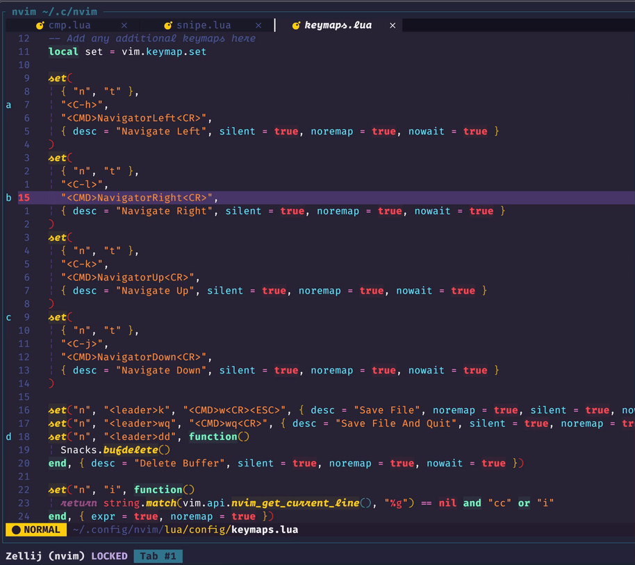

# snipe-marks.nvim

Yet another marks navigate nvim plugin depends on [leath-dub/snipe.nvim](https://github.com/leath-dub/snipe.nvim)

## How to use

```lua

{
  "nicholasxjy/snipe-marks.nvim",
  dependencies = { "leath-dub/snipe.nvim" },
  opts = {
    position = "cursor",
    mappings = {
      open = "<leader>m",
      cancel = "<esc>",
      select = "<cr>"
    }
  }
}
```

## Demo


